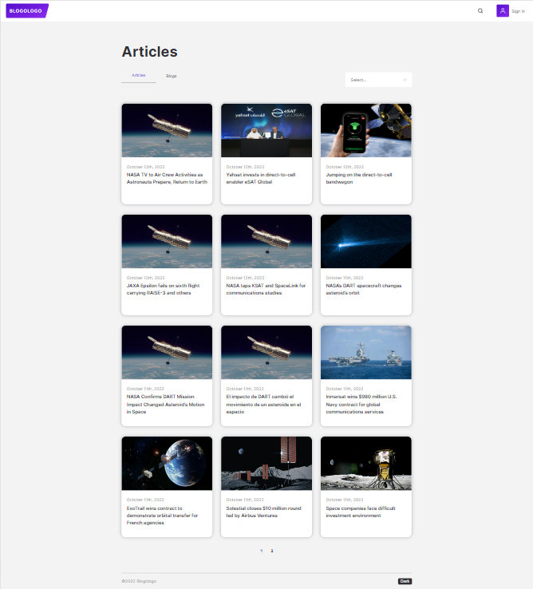
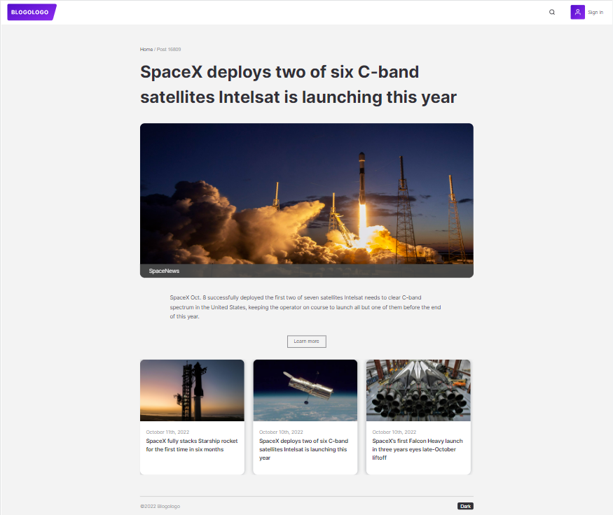
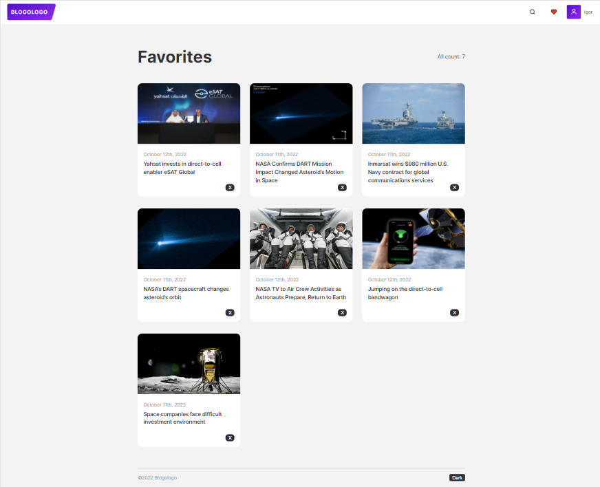

GH-Pages: "https://semajigr.github.io/React-blog/"

[![Contributors][contributors-shield]](https://github.com/semajigr/react-blog/graphs/contributors)
[![Forks][forks-shield]][forks-url]
[![Stargazers][stars-shield]][stars-url]
[![LinkedIn][linkedin-shield]][linkedin-url]

<a name="readme-top"></a>

<a name="readme-top"></a>

<br />
<div align="center">
  <a href="https://github.com/semajigr/React-blog/tree/develop">
    
  </a>

  <h3 align="center">Blogologo</h3>

  <p align="center">
       <br />
    <a href="https://github.com/semajigr/React-blog/tree/develop"><strong>Explore the docs »</strong></a>
    <br />
    <br />
    <a href="https://github.com/semajigr/React-blog/tree/develop">View Demo</a>
    ·
    <a href="https://semajigr.github.io/React-blog/">You can see result</a>
    ·

  </p>
</div>

<details>
  <summary>Table of Contents</summary>
  <ol>
    <li>
      <a href="#about-the-project">About The Project</a>
      <ul>
        <li><a href="#built-with">Built With</a></li>
      </ul>
    </li>
    <li>
      <a href="#getting-started">Getting Started</a>
      <ul>
        <li><a href="#prerequisites">Prerequisites</a></li>
        <li><a href="#installation">Installation</a></li>
      </ul>
    </li>
    <li><a href="#usage">Usage</a></li>
    <li><a href="#contact">Contact</a></li>
  </ol>
</details>

## About The Project

A web application with which you can find articles and blogs you are interested in, the application also has additional features that are described bellow.

<p align="right">(<a href="#readme-top">back to top</a>)</p>

### Built With

This section should list any major frameworks/libraries used to bootstrap your project. Leave any add-ons/plugins for the acknowledgements section. Here are a few examples.

- [![React][react.js]][react-url]
- [![styled-components][styled-components]][styled-components-url]
- [![React Router][reactrouter.com]][react-router-url]
- [![React Hook Form][react-hook-form.com]][react-hook-form-url]
- [![React Select][react-select.com]][react-select-url]
- [![Redux Toolkit][redux-toolkit.js.org]][redux-url]
- [![Framer Motion][framer.com]][framer-url]
- [![Firebase][firebase.google.com]][firebase-url]
- [![Redux Persist][github.com/rt2zz/redux-persist]][persist-url]
- [![keen-slider][keen-slider.com]][keen-slider-url]

<p align="right">(<a href="#readme-top">back to top</a>)</p>

## Getting Started

Use the `npm start` to get started.

### Prerequisites

Use the `npm install` to install all libraries.

### Installation

1. Clone the repo
   ```sh
   git clone https://github.com/semajigr/React-blog/tree/develop
   ```
2. Install NPM packages
   ```sh
   npm install
   ```
   <p align="right">(<a href="#readme-top">back to top</a>)</p>

## Usage

Once on the home page, the user sees the first 12 articles provided by the open database (Spaceflight News API).



By clicking on the article card, you can see detailed information as well as recommended articles.



Registration forms are easy to use and you can learn more about them by visiting the site.

By sign up you can place your favorite articles in your favorites.



## Contact

Igot Siomushkin - [semajigr@gmail.com](email)

Project Link: [https://github.com/semajigr/React-blog/tree/develop](https://github.com/semajigr/React-blog/tree/develop)

<p align="right">(<a href="#readme-top">back to top</a>)</p>
